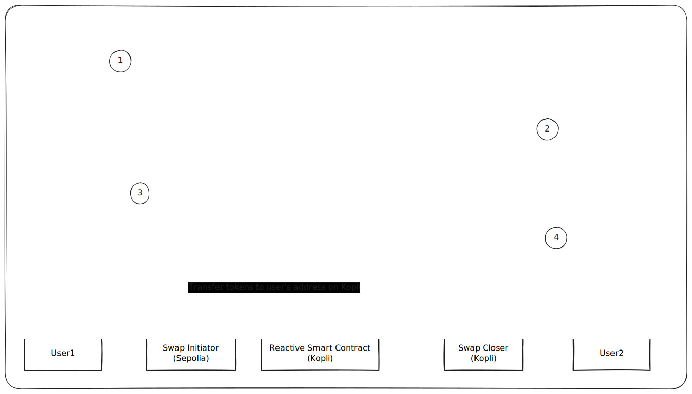

# DexTrade Demo PoC

## Overview
This repository contains a demonstration of integrating Reactive Smart Contracts (RSCs) with atomic swaps. The project simulates a peer-to-peer swap protocol without accounting for time expiration locks or mid-process user cancellations. The simulation flow involves:

1. User1 initiates a swap on the origin chain (Sepolia Testnet)
2. User2 closes the trade on the destination chain (Kopli Testnet)

## Key Achievement
Successfully eliminated the need for users to have gas on the destination chain to withdraw/claim tokens.

## Repository Structure

### Swap Contracts
Located in `contracts/p2p-swap-contracts`:

- **kopli-token.sol**: ERC20 token contract on destination chain
- **swap-initiator.sol**: Contract for User1 on origin chain (Sepolia) who wants to swap "USDT" to receive "KTKN" on Kopli Testnet
- **swap-closer.sol**: Contract for User2 on destination chain (Kopli) to acknowledge the swap and trade their KTKN for USDT

### Reactive Smart Contract
Located in `contracts/reactive-smart-contracts`:

- **rsc.sol**: Listens for `swap_initiated` event on the swap_initiator contract to obtain the receiver's address on the destination chain. Then monitors the token's `Deposited` event on the swap_closer contract and automatically calls `completeSwap` to transfer funds to the user's receiving address, eliminating the need for destination chain gas.

## Workflow

## Contract Addresses
- **swap_initiator (Sepolia)**: 0x5E456190C42E34ff3C20789cC6F987636a2AaE60
- **swap_closer (Kopli-testnet)**: 0xd0949d1D31f515F5814e8785c813d3C9582bF96A
- **reactive_smart_contract (Kopli-testnet)**: 0x6F9155C2150248641CC92096cd7Fe1041Ea77836